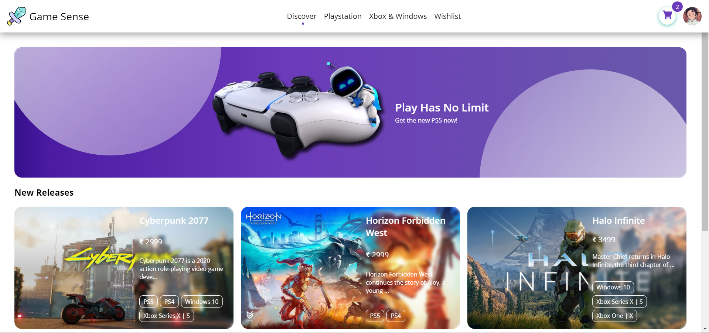
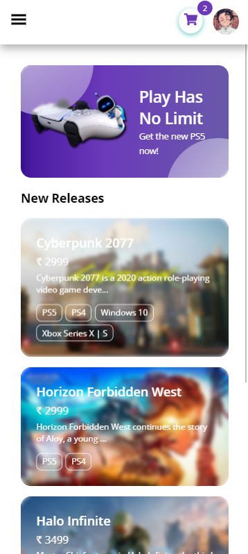
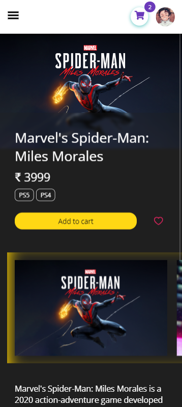

# Game Sense 🎮

An ecommerce platform for games available for wide variety of platforms.

Live link: https://ggsense.netlify.app

Backend: https://github.com/OmkarArora/game-sense-backend

---

## Tech stack

- Frontend
  - React
  - React Router
  - [Shoto UI](https://shotoui.netlify.app)
- Backend
  - Express
  - Mongoose
  - MongoDB
  - JWT

## Features

- User authentication : Login/SignUp
- Wishlist : Add/Remove products
- Cart : Add/Remove products
- Product Filters : Filter by price range and customer reviews

---

## Screenshots

### Desktop

### Mobile

<table align="center">
  <tr>
    <td></td>
    <td></td>
  </tr>
 </table>
